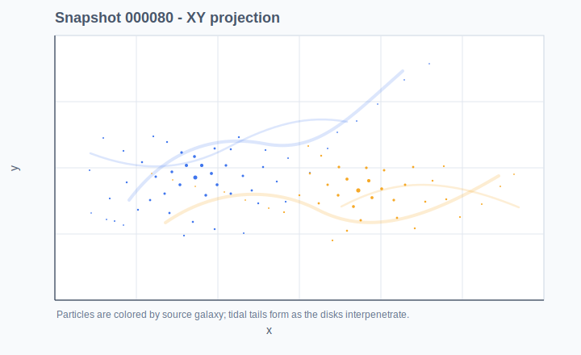
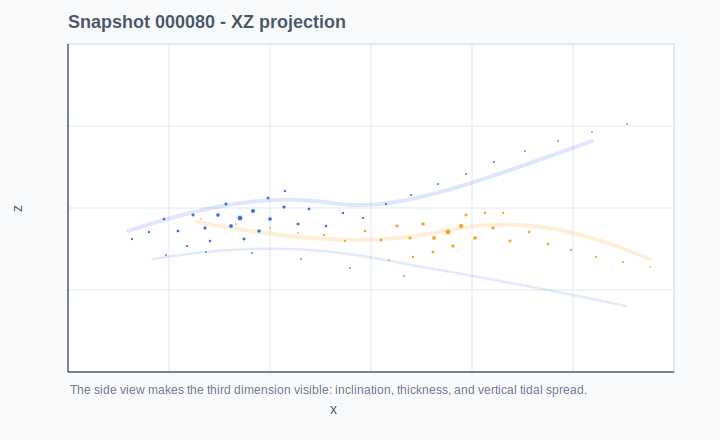
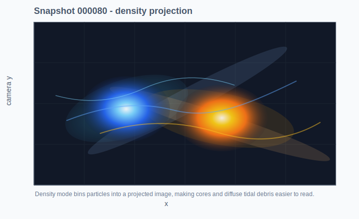

# Distributed Fast Multipole Galaxy Collision Simulator

A compact 3D gravitational N-body simulator for galaxy collision experiments. The project includes a working C++ simulation engine, CSV snapshot output, diagnostics, and Python plotting/animation tools.

## Features

- Softened Newtonian gravity in nondimensional units
- Direct `O(N^2)` force solver for correctness baselines
- Barnes-Hut octree solver with optional `p=4` far-field correction
- FMM solver with P2M/M2M aggregation, `p=4` Cartesian moments, M2L-style cell interaction lists, and P2P near-field leaves
- MPI rank ownership with all-rank particle synchronization
- Optional CUDA direct/P2P force and leapfrog kernels with CPU fallback
- Kick-drift-kick leapfrog integrator
- Reproducible disk-galaxy initial conditions from TOML-like configs
- CSV snapshots plus metadata and energy/momentum diagnostics
- Python snapshot loader, static plotting, and MP4/GIF animation scripts
- CTest smoke tests covering vectors, forces, integration, FMM accuracy, CUDA fallback, MPI ownership, config parsing, diagnostics, and snapshot writing

## Example Visuals

The animated GIF below was rendered from `p=4` FMM CSV snapshots generated by `configs/readme_1000_body_collision.toml`. The static SVGs are lightweight previews of the projection styles produced by the Python plotting tools.


The animation uses 1000 bodies across 300 saved simulation frames with a moving 3D camera.







## How The Solvers Work

The direct solver is the accuracy baseline: every particle interacts with every other particle, so the force calculation is `O(N^2)`. It is simple, deterministic, and useful for validating the approximate solvers on small particle counts.

Barnes-Hut accelerates the same gravity calculation with an octree. Each node stores aggregate mass, center of mass, and optional Cartesian multipole moments. For a target particle, far cells are accepted when their size-to-distance ratio is below `tree_theta`; those cells are evaluated as a single far-field source, while nearby cells are opened until the solver reaches leaves and computes direct particle-particle interactions. Smaller `tree_theta` values are slower but more accurate, and larger values are faster but more approximate.

The FMM path uses a fuller tree interaction pipeline. Leaves first convert particles into multipole moments (P2M), parent cells aggregate child moments (M2M), well-separated cells exchange far-field contributions with M2L-style interactions, and neighboring leaves are handled with direct P2P work. The expansion order controls how much structure each cell carries: `p=0` is monopole mass only, `p=2` adds quadrupole terms, and `p=4` includes fourth-order Cartesian moments for the highest accuracy target in this project. Compared with Barnes-Hut, FMM reuses cell-cell interactions more systematically, so it is designed to scale better at large particle counts while retaining tunable accuracy.

## Repository Layout

```text
cpp/core/       core particles, config, integrator, diagnostics, CLI
cpp/direct/     direct softened-gravity solver
cpp/fmm/        Barnes-Hut treecode and p=4 FMM solver
cpp/mpi/        rank ownership and particle synchronization helpers
cpp/cuda/       optional CUDA direct/P2P kernels and CPU fallback
cpp/io/         CSV snapshot and diagnostics writer
cpp/tests/      C++ smoke/unit tests
python/utils/   snapshot and diagnostics loaders
python/analysis/static plots
python/animation/MP4/GIF rendering
configs/        simulation configs
experiments/    output destinations and experiment notes
docs/           design, architecture, roadmap, testing plan
scripts/        build and smoke-test helpers
```

## Build

```bash
cmake -S . -B build -DCMAKE_BUILD_TYPE=Release -DENABLE_MPI=ON -DENABLE_CUDA=ON
cmake --build build -j
ctest --test-dir build --output-on-failure
```

If MPI or CUDA are not installed, CMake falls back to the serial CPU build.

On Windows PowerShell, if CMake is installed:

```powershell
.\scripts\build.ps1
.\scripts\run_smoke_test.ps1
```

## Run a Simulation

```bash
./build/fmm_galaxy_sim --config configs/smoke_test.toml
```

The default smoke config writes:

```text
experiments/validation/smoke_test/
  metadata.json
  diagnostics.csv
  snapshot_000000.csv
  snapshot_000010.csv
  ...
```

Choose a solver in the config:

```toml
[simulation]
solver = "fmm"          # direct, tree, fmm, cuda-direct
dim = 3
tree_theta = 0.6
tree_leaf_capacity = 16
fmm_expansion_order = 4 # 0 = monopole, 2 = quadrupole, 4 = fourth-order Cartesian
```

Run with MPI when available:

```bash
mpirun -np 4 ./build/fmm_galaxy_sim --config configs/smoke_test.toml
```

Run the CUDA direct/P2P kernel when a CUDA device is available:

```toml
[simulation]
solver = "cuda-direct"
```

## Python Analysis

Install dependencies:

```bash
python -m venv .venv
source .venv/bin/activate
pip install -r requirements.txt
```

Plot the latest snapshot and diagnostics:

```bash
python -m python.analysis.plot_snapshots --input experiments/validation/smoke_test --output smoke_snapshot.png
```

Render an animation:

```bash
python -m python.animation.render_snapshots --input experiments/validation/smoke_test --mode scatter3d --camera-orbit --output smoke_collision.mp4
```

Render a density projection:

```bash
python -m python.animation.render_snapshots --input experiments/validation/smoke_test --mode density --projection camera --output smoke_density.mp4
```

Create a self-contained interactive browser viewer:

```bash
python -m python.animation.interactive_viewer --input experiments/validation/smoke_test --output viewer.html
```
