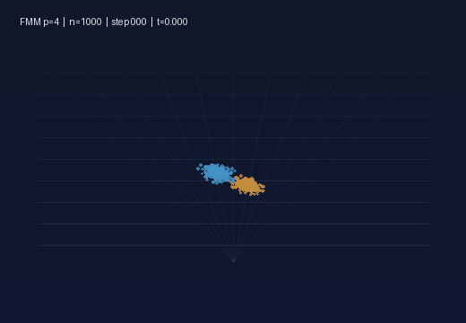
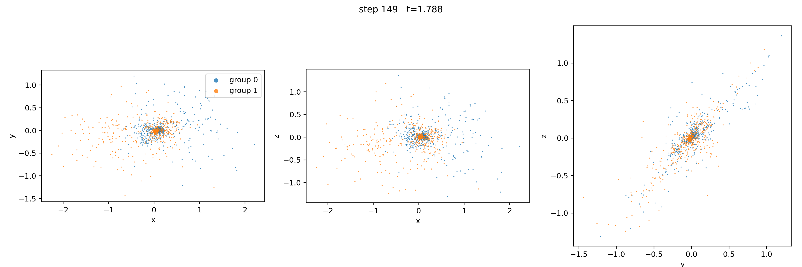
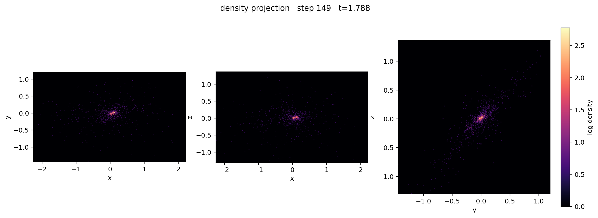

# Distributed Fast Multipole Galaxy Collision Simulator

[](https://github.com/ryan-charette/galaxy-collision-simulation/actions/workflows/ci.yml)
[](https://codecov.io/gh/ryan-charette/galaxy-collision-simulation)
[](LICENSE)
[](CHANGELOG.md)
[](CITATION.cff)
[](https://www.python.org/)
[](https://isocpp.org/)
[](https://cmake.org/)
[](https://github.com/catchorg/Catch2)
[](docs/)

A 3D gravitational N-body simulator for galaxy collision experiments. The project includes a working C++ simulation engine, CSV/Parquet snapshot output, diagnostics, and Python plotting/animation tools.

## Features

- Softened Newtonian gravity in nondimensional units
- Direct `O(N^2)` force solver for correctness baselines
- Barnes-Hut octree solver with optional `p=4` far-field correction
- FMM solver with P2M/M2M aggregation, `p=4` Cartesian moments, M2L-style cell interaction lists, and P2P near-field leaves
- MPI rank ownership with all-rank particle synchronization
- Optional CUDA direct/P2P force kernels, plus GPU evaluation paths for CPU-built tree and FMM interaction data
- Kick-drift-kick leapfrog integrator
- Reproducible disk-galaxy initial conditions from TOML-like configs
- CSV or Apache Parquet snapshots plus metadata and energy/momentum diagnostics
- Python snapshot loader, static plotting, and MP4/GIF animation scripts
- Catch2/CTest smoke tests covering vectors, forces, integration, FMM accuracy, CUDA fallback, MPI ownership, config parsing, diagnostics, and snapshot writing

## Example Visuals

The images below were rendered from real `p=4` FMM CSV snapshots generated by `configs/readme_1000_body_collision.toml`. The animated GIF uses the lightweight README snapshot renderer; the static PNGs are produced by `python.analysis.plot_snapshots`.



The animation uses 1000 bodies across 300 saved simulation frames with a moving 3D camera.





## Benchmarking

### CPU
The table below comes from `scripts/run_benchmarks.py` on a local CPU build used for README artifact generation with 20 integration steps and three repetitions per case. These small-to-mid `N` cases include process startup and CSV output for step 0 plus the final step, so they are best read as end-to-end smoke benchmarks rather than peak kernel throughput. In the current build, direct summation is faster at these sizes; the FMM path currently pays substantial tree/multipole overhead while prioritizing correctness and higher-order expansion support.

| Solver | Particles | Steps | Median wall time (s) | Steps/s | Particle-steps/s |
|---|---:|---:|---:|---:|---:|
| `direct` | 250 | 20 | 0.035 | 573.56 | 143,391 |
| `tree` | 250 | 20 | 0.133 | 150.87 | 37,717 |
| `fmm` | 250 | 20 | 0.298 | 67.02 | 16,755 |
| `direct` | 500 | 20 | 0.051 | 390.19 | 195,096 |
| `tree` | 500 | 20 | 0.381 | 52.49 | 26,243 |
| `fmm` | 500 | 20 | 1.131 | 17.68 | 8,840 |
| `direct` | 1000 | 20 | 0.103 | 194.56 | 194,560 |
| `tree` | 1000 | 20 | 1.377 | 14.52 | 14,521 |
| `fmm` | 1000 | 20 | 5.878 | 3.40 | 3,402 |

Raw benchmark results are saved in `docs/benchmarks/local_cpu_benchmark.csv`, with a generated Markdown copy in `docs/benchmarks/local_cpu_benchmark.md`.

### GPU
The following table comes from `experiments/benchmarks/a100/` on an NVIDIA A100-SXM4-40GB GPU build. The fastest measured path is `cuda-tree` with monopole forces (`fmm_expansion_order = 0`). Its best throughput is the 500,000-particle case at 787,735 particle-steps/s.

| Solver | Expansion | Particles | Steps | Median wall time (s) | Particle-steps/s |
|---|---:|---:|---:|---:|---:|
| `cuda-tree` | 0 | 500,000 | 5 | 3.174 | 787,735 |
| `cuda-tree` | 0 | 1,000,000 | 5 | 7.079 | 706,330 |
| `cuda-fmm` | 0 | 1,000,000 | 5 | 48.268 | 103,589 |
| `cuda-tree` | 2 | 250,000 | 5 | 27.300 | 45,788 |
| `cuda-fmm` | 2 | 250,000 | 5 | 37.007 | 33,777 |
| `cuda-tree` | 4 | 250,000 | 5 | 54.505 | 22,933 |
| `cuda-fmm` | 4 | 250,000 | 5 | 66.925 | 18,678 |

See `docs/benchmarks/README.md` for the benchmark index and `experiments/benchmarks/a100/README.md` for the full A100 summary, raw CSVs, logs, and generated benchmark configs.

## Repository Layout

```text
src/cpp/core/       config, provenance, integrator, diagnostics, CLI, simulation runner
src/cpp/direct/     direct softened-gravity solver
src/cpp/fmm/        shared tree geometry, Barnes-Hut treecode, and FMM solver
src/cpp/mpi/        rank ownership and particle synchronization helpers
src/cpp/cuda/       optional CUDA direct/P2P kernels and CPU fallback
src/cpp/io/         CSV/Parquet snapshot, diagnostics, JSON, and conversion helpers
src/cpp/tests/      C++ smoke/unit tests
src/python/utils/   snapshot and diagnostics loaders
src/python/analysis/ static plots and solver-crossover reports
src/python/animation/ MP4/GIF rendering
configs/        simulation configs
experiments/    output destinations and experiment notes
docs/           design, architecture, milestones, testing plan
scripts/        build and smoke-test helpers
```

## Build

```bash
cmake -S . -B build -DCMAKE_BUILD_TYPE=Release -DENABLE_MPI=ON -DENABLE_CUDA=ON -DFMM_GALAXY_FETCH_TEST_DEPS=ON
cmake --build build -j
ctest --test-dir build --output-on-failure
```

If MPI or CUDA are not installed, CMake falls back to the serial CPU build. If
Catch2 is already installed, omit `-DFMM_GALAXY_FETCH_TEST_DEPS=ON`; for
install-only builds without tests, pass `-DBUILD_TESTING=OFF`.

Install the C++ simulator, headers, configs, and CMake package metadata:

```bash
cmake --install build --prefix install
```

Install the Python analysis and rendering commands:

```bash
python -m pip install .
```

On Windows PowerShell, if CMake is installed:

```powershell
.\scripts\build.ps1
.\scripts\run_smoke_test.ps1
```

## Tutorials

- [Installation](docs/install.md)
- [Run a simulation](docs/tutorials/run_simulation.md)
- [Python analysis and experiment workflows](docs/tutorials/python_analysis.md)

## Community

- [Contributing guide](CONTRIBUTING.md)
- [Citation metadata](CITATION.cff)
- [Security policy](SECURITY.md)
- [Support guidance](SUPPORT.md)
- [Code of conduct](CODE_OF_CONDUCT.md)
- [Changelog](CHANGELOG.md)

## References

- Ying, L. (2012). [A pedestrian introduction to fast multipole methods](https://web.stanford.edu/~lexing/pfmm.pdf).
  *Science China Mathematics*, 55(5), 1043-1051.
